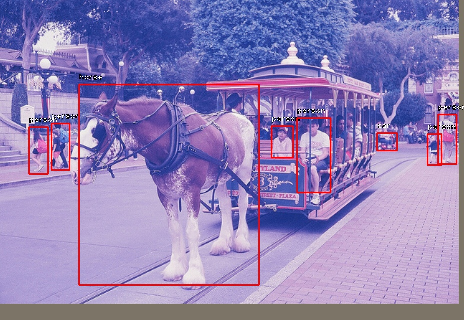
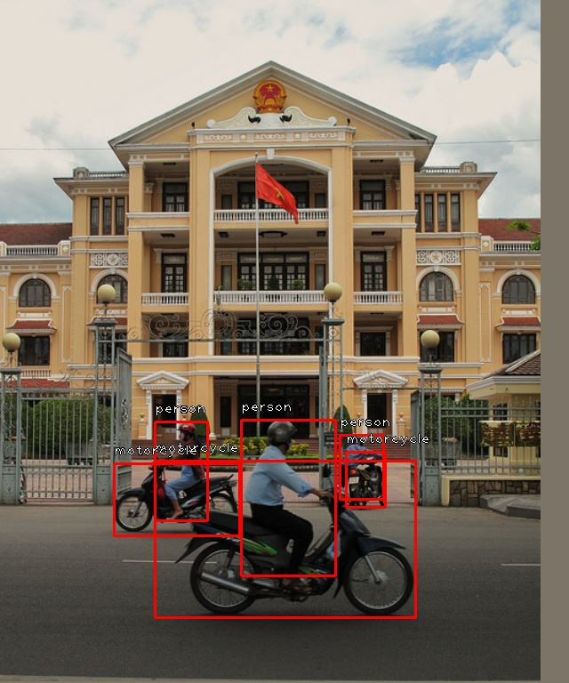
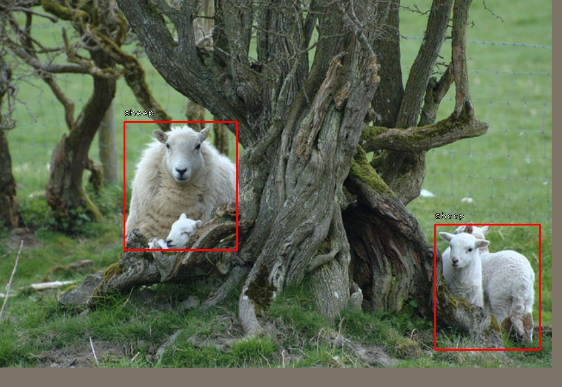
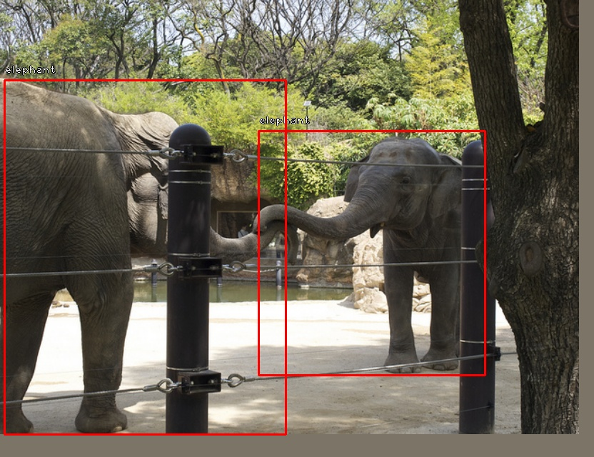
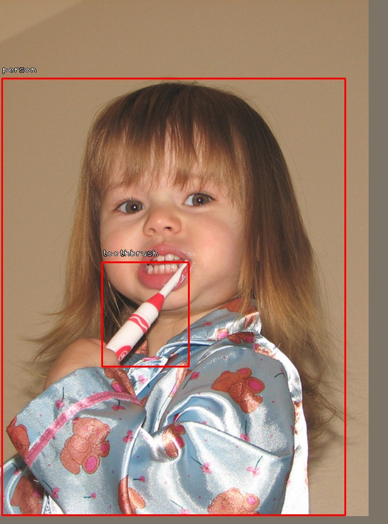
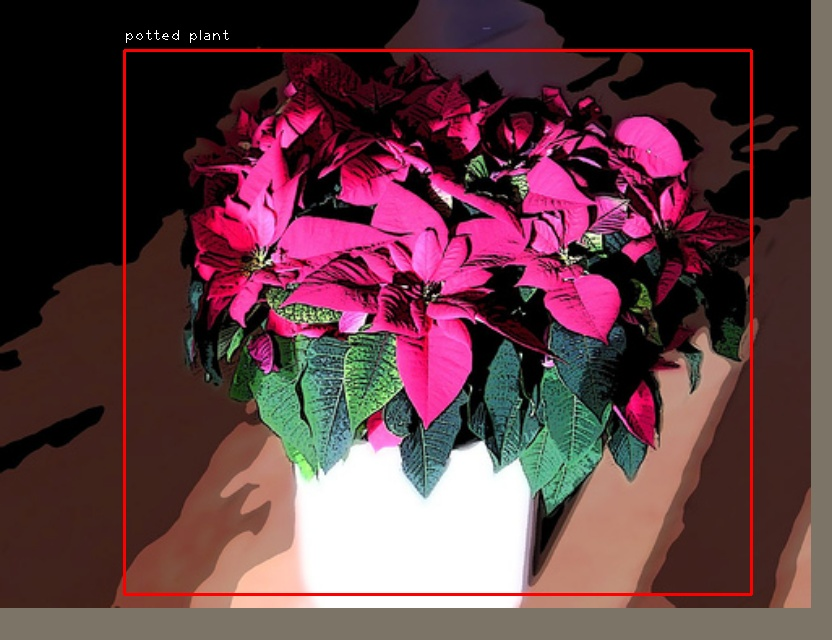
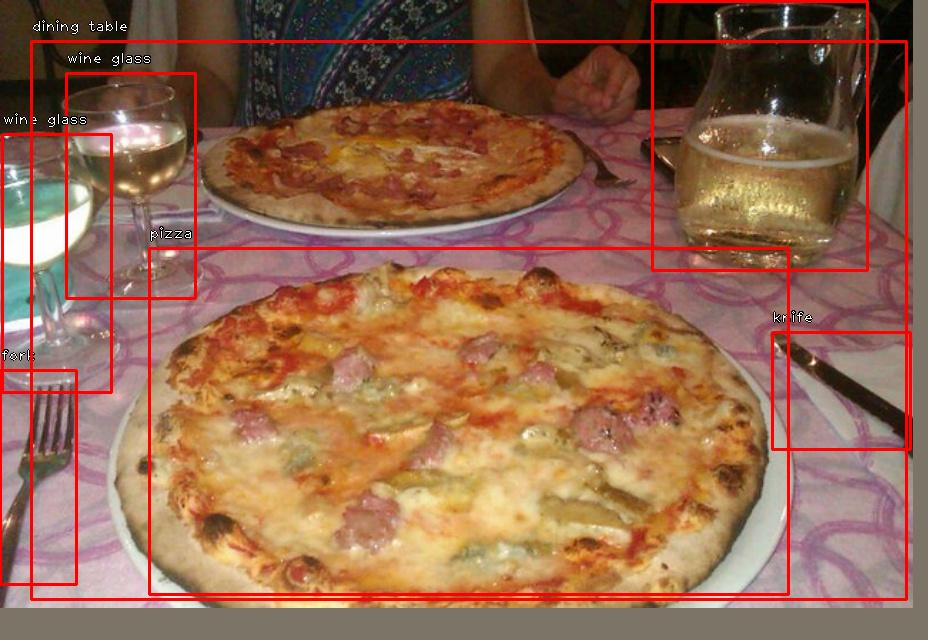
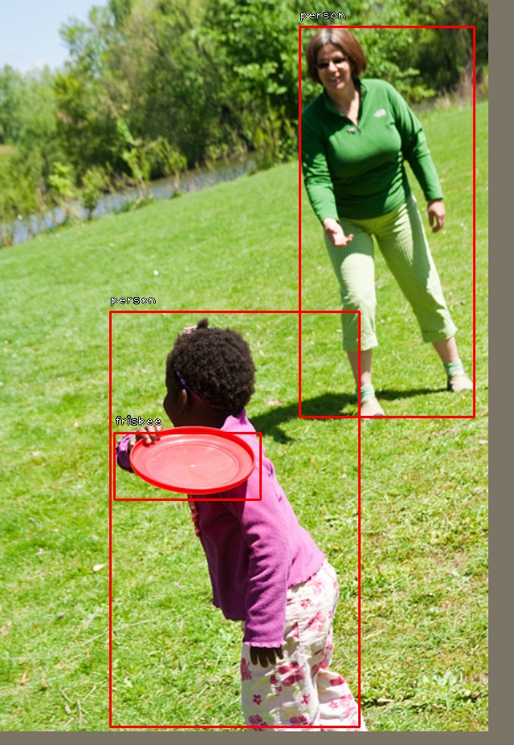

# jittor-retinanet

本项目基于 [Jittor 框架](https://github.com/Jittor/jittor) 复现经典目标检测模型 [RetinaNet](https://arxiv.org/pdf/1708.02002v2.pdf)，对齐并评估了 PyTorch 与 Jittor 两种实现方式在 **COCO 2017** 数据集上采样部分数据进行训练的性能与精度表现。

<div style="display: flex; flex-wrap: wrap; gap: 10px;">
  
  
  
  
  
  
  
  
</div>

<div style="display: grid; grid-template-columns: repeat(2, 1fr); gap: 10px; width: 80%; margin: auto;">
  
  
  
  
  
  
  
  
</div>

### 项目内容


- 基于 [PyTorch 实现](https://github.com/yhenon/pytorch-retinanet)，使用预训练 ResNet50 采样 10,000 张图片进行训练，同时记录训练日志和评估日志；
- 使用 **Jittor 框架** 对齐 PyTorch 实现，并在相同配置下进行训练和评估；
- 对 **两种版本（PyTorch / Jittor）** 的训练性能、检测精度（mAP）、收敛速度和损失变化进行对比分析。

<可视化 part>

### 项目结构

```wiki

```

### 环境配置

#### 硬件环境

```bash
+-----------------------------------------------------------------------------------------+
| NVIDIA-SMI 550.90.07              Driver Version: 550.90.07      CUDA Version: 12.4     |
|-----------------------------------------+------------------------+----------------------+
| GPU  Name                 Persistence-M | Bus-Id          Disp.A | Volatile Uncorr. ECC |
| Fan  Temp   Perf          Pwr:Usage/Cap |           Memory-Usage | GPU-Util  Compute M. |
|                                         |                        |               MIG M. |
|=========================================+========================+======================|
|   0  NVIDIA A10                     On  |   00000000:00:06.0 Off |                    0 |
|  0%   36C    P0             16W /  150W |     4MiB /  23028MiB |      0%      Default |
|                                         |                        |                  N/A |
+-----------------------------------------+------------------------+----------------------+
|   1  NVIDIA A10                     On  |   00000000:00:07.0 Off |                    0 |
|  0%   35C    P8             15W /  150W |       4MiB /  23028MiB |      0%      Default |
|                                         |                        |                  N/A |
+-----------------------------------------+------------------------+----------------------+
|   2  NVIDIA A10                     On  |   00000000:00:08.0 Off |                    0 |
|  0%   37C    P8             16W /  150W |       4MiB /  23028MiB |      0%      Default |
|                                         |                        |                  N/A |
+-----------------------------------------+------------------------+----------------------+
|   3  NVIDIA A10                     On  |   00000000:00:09.0 Off |                    0 |
|  0%   34C    P8             15W /  150W |       4MiB /  23028MiB |      0%      Default |
|                                         |                        |                  N/A |
+-----------------------------------------+------------------------+----------------------+

```

#### Pytorch

```bash
pip install pandas
pip install pycocotools
pip install opencv-python
pip install requests
```

#### Jittor

docker安装：

```bash
docker pull jittor/jittor-cuda:11.1-16.04
```

anaconda 安装：

```bash
conda create -n jittor python=3.8
conda activate jittor
conda install pywin32
pip install jittor
# 测试是否安装成功
python -m jittor.test.test_core
python -m jittor.test.test_example
python -m jittor.test.test_cudnn_op
```

### 使用方法

#### 数据准备

下载 coco 2017 数据集：

```python
python prepare_data.py
```

或者您可以使用我们的 [tiny_coco数据集](https://www.kaggle.com/datasets/weipengchao/tiny-coco1k) 先跑通一遍流程。

#### 模型训练

在各自根目录执行：

```bash
python train.py --dataset coco --coco_path ./coco --depth 50  --epochs 5 --batch_size 2
```

#### 模型验证

在各自根目录执行：

```bash
python coco_validation.py --coco_path ./coco --model <your_model_path>
```

### 训练结果

详见于训练日志。

| framework | backbone | epochs | bactch_size | coco mAP@[.5:.95] |
| --------- | -------- | ------ | ----------- | ----------------- |
| pytorch   | resnet50 | 5      |             |                   |
| jittor    | resnet50 | 5      | 2           | 0.250             |
|           |          |        |             |                   |

### 对齐验证

### 相关资源

| 说明                        | 链接                                                         |
| --------------------------- | ------------------------------------------------------------ |
| pytorch + resnet50 训练模型 | https://drive.google.com/file/d/181qIwc7JePD6m8eJ4O2k7uqVfSiFy4Zg/view |
| jittor + resnet50 训练模型  | https://drive.google.com/file/d/1NPznVTl7dpHWaFs9ncLAlwUIKdOusrar/view?usp=drive_link |
| tiny_coco 数据集            | https://www.kaggle.com/datasets/weipengchao/tiny-coco1k      |
