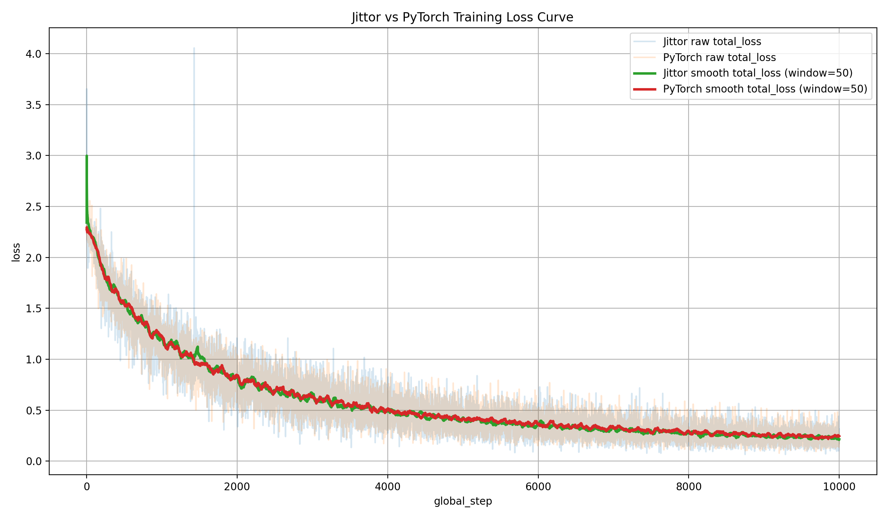
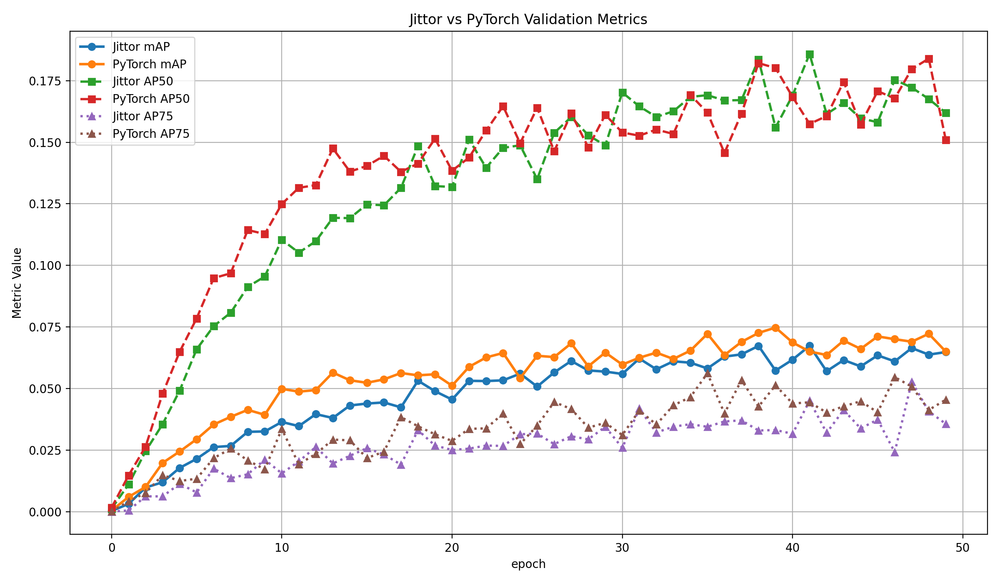
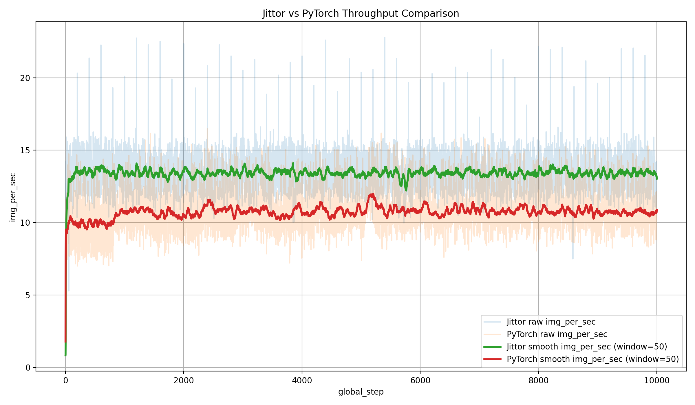
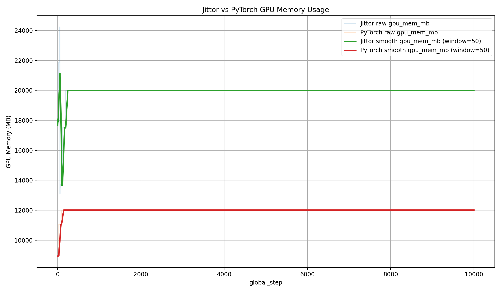

# jittor-retinanet

本项目基于 [Jittor 框架](https://github.com/Jittor/jittor) 实现了经典目标检测模型 [RetinaNet](https://arxiv.org/pdf/1708.02002v2.pdf)。

实验采用 COCO2017 子集进行训练，并对 Jittor 与 Pytorch 两种框架在训练过程中的性能表现进行了对比分析。


## 环境配置


### Pytorch

```bash
pip install pandas
pip install pycocotools
pip install opencv-python
pip install requests
```

### Jittor

docker安装：

```bash
docker pull jittor/jittor-cuda:11.1-16.04
```


anaconda 安装：

```bash
conda create -n jittor python=3.8
conda activate jittor
pip install jittor
python -m jittor.test.test_core
python -m jittor.test.test_example
python -m jittor.test.test_cudnn_op
```


## 数据准备

COCO 2017 数据集：

```python
python tools/download_coco2017.py
```

子集:

```python
python tools/create_tinyCOCO.py
```

或者直接[下载](https://www.kaggle.com/datasets/weipengchao/tiny-coco1k)。

## 模型训练

在各自根目录执行：

```bash
python train.py --coco_path ./coco --depth 50 --epochs 50 --batch_size 4
```

## 模型验证

在各自根目录执行：

```bash
python coco_validation.py --coco_path ./coco --model <your_model_path>
```

## 实验现象

均使用 NVIDIA RTX 3090 训练和验证。

### Loss Curve

训练初期 Jittor Loss 更高, 可能与以下因素有关: 1） 不用框架的默认初始化策略; 2) 数值计算实现差异 3) 优化器更新顺序或精度差异。

不过随着训练进行, 两条曲线逐渐接近。



### val_metrics

在当前实验配置下, 两者差距整体较小, 训练效果处于相近水平。



### throughput

从统计结果和曲线来看, Jittor 在训练阶段的吞吐量明显高于 Pytorch. Jittor 的平均吞吐量为 13.41 img/sec, Pytorch 为 10.72 img/sec, 提升约 25.17%。说明在当前实验环境中，Jittor 在训练效率上有一定优势。

```bash
===== Jittor Throughput Stats =====
Samples      : 10000
Mean         : 13.4147
Median       : 13.3100
Max          : 22.7800
Min          : 0.8300
Last         : 13.0500

===== PyTorch Throughput Stats =====
Samples      : 10000
Mean         : 10.7171
Median       : 10.6300
Max          : 16.5000
Min          : 1.7800
Last         : 10.5600

Jittor vs PyTorch mean throughput diff: 25.17%
```



### gpu_mem

从结果可以看出，Jittor 的显存占用显著高于 PyTorch。Jittor 平均显存占用约为 19.93 GB，而 PyTorch 约为 11.99 GB，平均高出约 66.20%；峰值显存占用则分别达到 24.23 GB 和 12.01 GB，峰值差异约为 101.74%。

不过，两种框架的显存曲线在训练初期完成分配后都很快趋于平稳，后续训练过程中未出现持续增长现象，说明两者在当前实验中均未出现明显的显存泄漏问题。综合来看，Jittor 在吞吐量上具有更高优势，但代价是更高的显存占用。



```bash
===== Jittor GPU Memory Stats =====
Samples      : 10000
Mean         : 19933.2958 MB
Median       : 19987.0000 MB
Max          : 24227.0000 MB
Min          : 13073.0000 MB
Last         : 19989.0000 MB

===== PyTorch GPU Memory Stats =====
Samples      : 10000
Mean         : 11993.8202 MB
Median       : 12009.0000 MB
Max          : 12009.0000 MB
Min          : 8935.0000 MB
Last         : 12009.0000 MB

Mean memory diff (Jittor vs PyTorch): 66.20%
Peak memory diff (Jittor vs PyTorch): 101.74%
```

## 现象分析

1. Loss 趋势一致, 说明模型结构、优化器逻辑、数据 pipeline 一致，Jittor 实现是正确的。

2. 关于精度的细微差异，我们认为受以下角度影响: 1) 框架之间的数值实现差异: reduction 顺序、float 精度、cudnn kernel; 2) 算子实现差异: 例如 NMS、Focal Loss、Anchor Assignment 的实现细节差异 (未验证); 3) 目标检测本身的随机性: data augmentation、batch sampling、floating error。

3. Jittor 的更高吞吐量: Jittor 是 Just-in-Time Compilation + Lazy execution, Pytorch 是 eager execution. 以 `y = x * 2 + 3 ` 为例:
- Pytoch 执行方式: `调用一个算子 -> CUDA Kernel -> 再调用下一个算子`, 每个操作都是独立 kernel, 可能执行为 `kernel1: multiply kernel2: add`。
- Jittor 使用 lazy execution + JIT 编译: `Python graph -> 计算图 -> JIT 编译 -> 融合算子`, 上面的操作可能变成 : `kernel: y = x*2+3`。

    这种 **operator Fusion** 能够减少 kernel launch，减少 gpu memory IO 并提高 gpu 利用率。 同时 Lazy execution 可以让 Jittor 做更多优化和算子融合，减少 py 的调度开销。

4. 显存占用: 我们认为 Jittor 为了支持 JIT、op fusion 以及 lazy execution 等操作，会保留更多中间 tensor，导致计算占用显存更大。而 Pytorch 的显存管理经过多年优化非常成熟: `CUDA acching allocator, memory reuse, tensor lifrcycle tracking`。

总结:
- Jittor: JIT compile, operator fusion, lazy execution, targets to computation efficiency
- Pytorch: eager execution, 成熟的内存管理，稳定算子实现，targets to 稳定与生态

----

We acknowledge [Dun Liang (CJLD)](https://cjld.github.io/) for his great work on the Jittor deep learning framework.