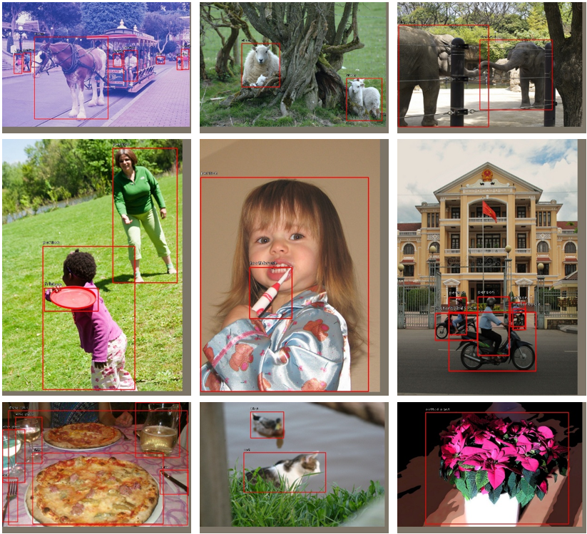
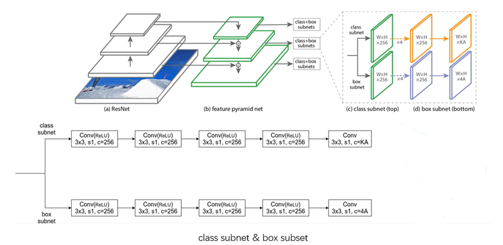
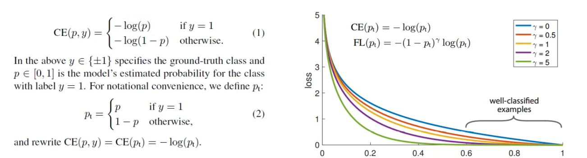
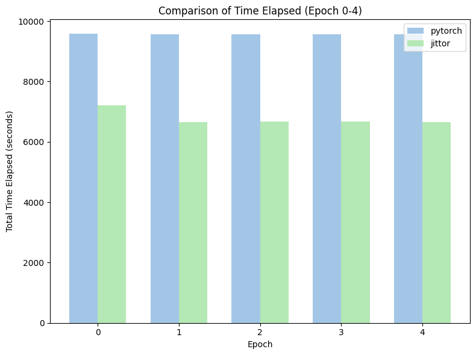
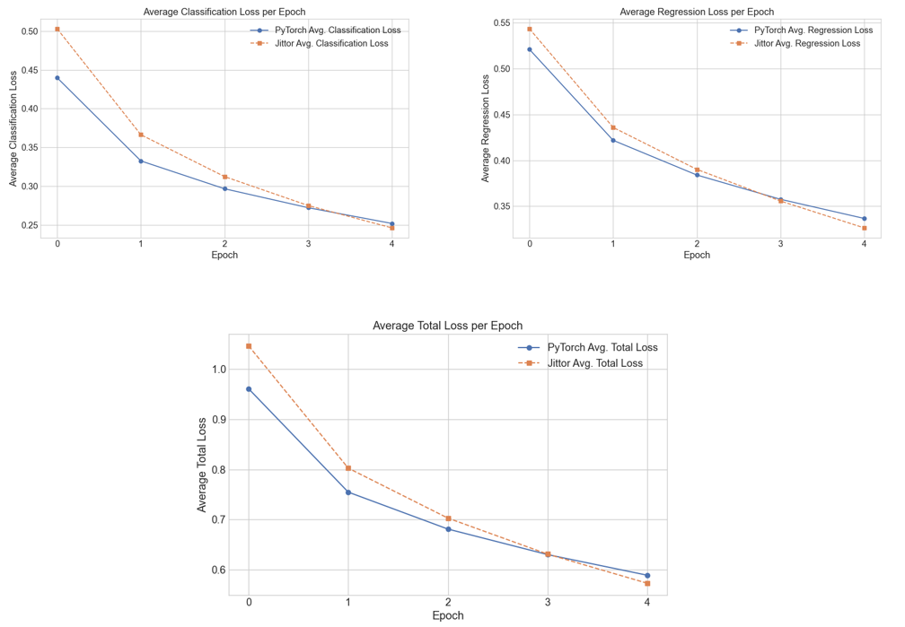
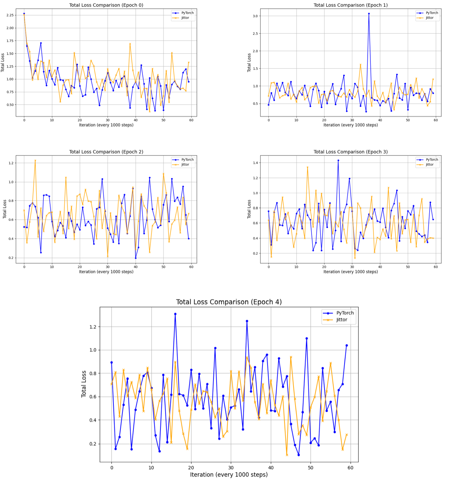
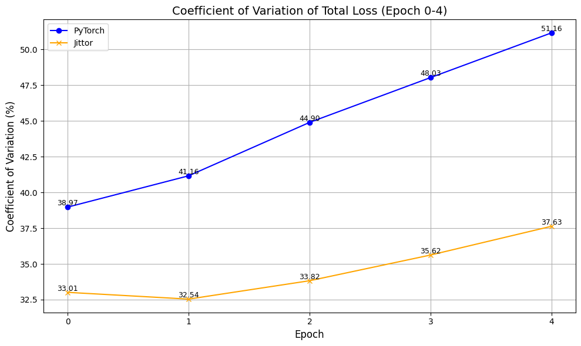
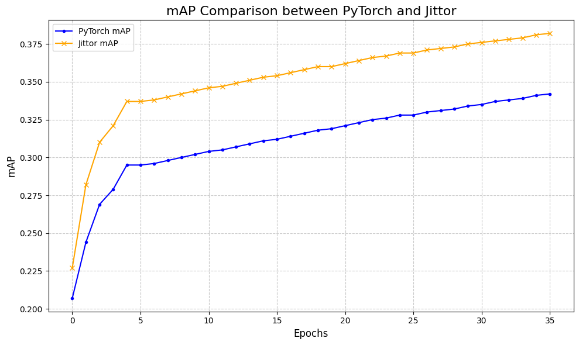

# jittor-retinanet

该项目基于 [Jittor 框架](https://github.com/Jittor/jittor) 复现经典目标检测模型 [RetinaNet](https://arxiv.org/pdf/1708.02002v2.pdf)，基于 COCO2017 数据集进行训练。此外，项目针对原始的 Focal Loss 进行了创新性改进，提出了一种新的损失函数——**Dynamic Logit Focal Loss**。



### 模型介绍

- **Retinanet**：RetinaNet是由Facebook AI Research团队在2017年提出的一种目标检测算法。与传统的目标检测算法不同，RetinaNet特别关注类别不平衡问题，尤其是在面对背景和前景类别数量差异巨大的场景时，表现尤为突出。它通过一种叫做焦点损失（Focal Loss）的创新技术，解决了目标检测中常见的类别不平衡问题。

  
- **Network Architecture**：RetinaNet是由Resnet、FPN为主要架构，detection部分则是由两个FCN 子网路组成，分别用于预测分类及边缘框识别。
- **Focal Loss**：Retinanet 通过 Focal Loss，解决了目标检测中常见的类别不平衡问题。
     
- **Dynamic Logit Focal Loss**：在 logit 空间计算 loss，提高数值稳定性，在此基础上，让模型根据 logit 动态调整调制因子，更好指导模型学习。


### 项目结构

```wiki
jittor-retinanet/
├── LICENSE
├── README.md
├── jittor-retinanet/
│   ├── coco_validation.py
│   ├── logs/
│   │   ├── train_log.csv
│   │   └── val_log.csv
│   ├── myretinanet/
│   │   └── dataloader.py
│   ├── myutils/
│   │   └── optim.py
│   ├── retinanet/
│   │   ├── anchors.py
│   │   ├── coco_eval.py
│   │   ├── dataloader.py
│   │   ├── losses.py
│   │   ├── model.py
│   │   ├── oid_dataset.py
│   │   └── utils.py
│   ├── train.py
│   └── visualize.py
├── pytorch-retinanet/
│   ├── coco_validation.py
│   ├── retinanet/
│   │   ├── anchors.py
│   │   ├── coco_eval.py
│   │   ├── dataloader.py
│   │   ├── losses.py
│   │   ├── model.py
│   │   ├── oid_dataset.py
│   │   └── utils.py
│   └── train.py
└── tools/
    ├── download_coco2017.py
    ├── img/
    └── tiny_coco_creator/
        ├── addInfo.py
        ├── dataCreator.py
        ├── splitData.py
        └── tiny_coco_1k.json
```

### 环境配置

#### 硬件环境

```bash
+-----------------------------------------------------------------------------------------+
| NVIDIA-SMI 550.90.07              Driver Version: 550.90.07      CUDA Version: 12.4     |
|-----------------------------------------+------------------------+----------------------+
| GPU  Name                 Persistence-M | Bus-Id          Disp.A | Volatile Uncorr. ECC |
| Fan  Temp   Perf          Pwr:Usage/Cap |           Memory-Usage | GPU-Util  Compute M. |
|                                         |                        |               MIG M. |
|=========================================+========================+======================|
|   0  NVIDIA A10                     On  |   00000000:00:06.0 Off |                    0 |
|  0%   36C    P0             16W /  150W |       4MiB /  23028MiB |      0%      Default |
|                                         |                        |                  N/A |
+-----------------------------------------+------------------------+----------------------+
|   1  NVIDIA A10                     On  |   00000000:00:07.0 Off |                    0 |
|  0%   35C    P8             15W /  150W |       4MiB /  23028MiB |      0%      Default |
|                                         |                        |                  N/A |
+-----------------------------------------+------------------------+----------------------+
|   2  NVIDIA A10                     On  |   00000000:00:08.0 Off |                    0 |
|  0%   37C    P8             16W /  150W |       4MiB /  23028MiB |      0%      Default |
|                                         |                        |                  N/A |
+-----------------------------------------+------------------------+----------------------+
|   3  NVIDIA A10                     On  |   00000000:00:09.0 Off |                    0 |
|  0%   34C    P8             15W /  150W |       4MiB /  23028MiB |      0%      Default |
|                                         |                        |                  N/A |
+-----------------------------------------+------------------------+----------------------+

```

#### Pytorch

```bash
pip install pandas
pip install pycocotools
pip install opencv-python
pip install requests
```

#### Jittor

docker安装：

```bash
docker pull jittor/jittor-cuda:11.1-16.04
```

anaconda 安装：

```bash
conda create -n jittor python=3.8
conda activate jittor
conda install pywin32
pip install jittor
# 测试是否安装成功
python -m jittor.test.test_core
python -m jittor.test.test_example
python -m jittor.test.test_cudnn_op
```

### 使用方法

#### 数据准备

下载 coco 2017 数据集：

```python
python /tools/download_coco2017.py
```

或者您可以使用我们的 [tiny_coco数据集](https://www.kaggle.com/datasets/weipengchao/tiny-coco1k) 先跑通一遍流程。

然后将数据集按照如下结构组织：

```bash
<pytorch/jittor>-retinanet/
└── coco/
    ├── annotations/
    │   ├── instances_train2017.json
    │   └── instances_val2017.json
    └── images/
        ├── train2017/
        │   ├── 000000000009.jpg
        │   └── ...
        └── val2017/
            ├── 000000000139.jpg
            └── ...
```

#### 模型训练

在各自根目录执行：

```bash
python train.py --dataset coco --coco_path ./coco --depth 50  --epochs 5 --batch_size 2
```

#### 模型验证

在各自根目录执行：

```bash
python coco_validation.py --coco_path ./coco --model <your_model_path>
```

#### 可视化

在 jittor-retinanet 目录执行：

```bash
python visualize.py --dataset tiny_coco --coco_path ./tiny_coco --model <your_model_path>
```

或者直接[下载](https://drive.google.com/drive/folders/1uUDtQOu3O3s7rrGU3qecfho8HZqWsGYx?usp=drive_link)查看我们的可视化结果。

### 训练结果

详见于[pytorch-logs](https://github.com/Running-Turtle1/jittor-retinanet/tree/main/pytorch-retinanet/logs) 和 [Jittor-logs](https://github.com/Running-Turtle1/jittor-retinanet/tree/main/jittor-retinanet/logs)。

UPD IN 2025/08/16，增加了更多的 epochs 进行训练。

| framework | backbone | epochs | bactch_size | coco mAP@[.5:.95] |
| --------- | -------- | ------ | ----------- | ----------------- |
| jittor    | resnet50 | 35      | 2           | 0.382             |
| pytorch   | resnet50 | 35      | 2           | 0.342            |

### 对齐验证

#### 训练性能对比

分析前 5 个 epoch：



- Jittor 平均训练时间: 6772.70 秒/epoch；PyTorch 平均训练时间: 8,884.86 秒/epoch

- 在本实验中，PyTorch 的训练速度比 Jittor 快了 **~31.2%**。

#### 损失变化对比

分析前 5 个 epoch：



- 在 0-3 个 epoch 中，Jittor 的总损失比 PyTorch 略高，到第4个 epoch，Jittor 实现了 **反超**，损失更低

#### 训练稳定性

分析前 5 个 epoch：





- 相较于 Pytorch 存在不稳定峰值，Jittor 损失曲线更平稳，波动范围小，变异系数大概下降了 **~10%**。

#### 精度对比



- 相较于 PyTorch 的实现，Jittor 版本的 RetinaNet 在 COCO mAP@[.5:.95] 指标上达到了 **~0.38**，精度提升了 **11%**。

### 优化建议

- **Backbone替换**：论文中使用Resnet50以及Resnet101，改用更深的Resnet152以及其他变体、使用ResNeXt模型、或者使用Swin Transformer 或 EfficientNet 等网络；
- **FPN改进**：FPN改进：论文中用了p3~p7的尺度，可以增加尺度提高准确率；也可以调整FPN的通道数；
- **关于FPN中FCN的使用**：可以增加提取的步骤，在通过backbone提取的特征层次之间或者是抽取特征之后，加入额外卷积模型进行更深层次的加工。

### 相关资源

| 说明                        | 链接                                                         |
| --------------------------- | ------------------------------------------------------------ |
| pytorch + resnet50 训练模型 | https://drive.google.com/file/d/1i7K8RT9BuuMspP-OTTRvQBcAk2d9dq2o/view?usp=drive_link |
| jittor + resnet50 训练模型  | https://drive.google.com/file/d/1NPznVTl7dpHWaFs9ncLAlwUIKdOusrar/view?usp=drive_link |
| tiny_coco 数据集            | https://www.kaggle.com/datasets/weipengchao/tiny-coco1k      |
|tiny_coco 评测集全部可视化结果|https://drive.google.com/drive/folders/1uUDtQOu3O3s7rrGU3qecfho8HZqWsGYx?usp=drive_link|
